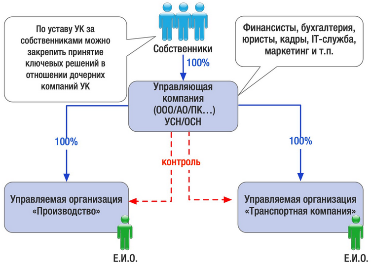

---
authors:
- admin
categories: []
date: "2019-02-05T00:00:00Z"
draft: false
featured: false
image:
  caption: ""
  focal_point: ""
lastMod: "2019-09-05T00:00:00Z"
projects: []
subtitle: Зачем нужна УК
summary: Зачем нужна УК
tags: []
title: Управляющая компания для бизнеса, возможности, варианты и риски
---

1. Наличие потребности у всех субъектов группы компаний в общих для них вспомогательных функциях: бухгалтерских, юридических, кадровых, IT, маркетинговых и иных услугах. Их обособление в отдельной организации управленчески и экономически более выгодно, чем создание аналогичных штатных служб в каждой отдельной компании.

Чаще всего у управляемых юридических лиц нет ни своего юриста, ни бухгалтера, ни системного администратора - всем этим занимается персонал управляющей компании. Объективно, не каждый бизнес способен потянуть такой штат в каждой отдельной организации Группы. Но даже при таком варианте организационной структуры должно быть центральное звено, управляющее сотрудниками на местах.

Поэтому встречаются случаи создания функционально схожих между собой служб и в УК, и в управляемом обществе (например, при разветвленности структуры, когда отдельные общества существенно удалены друг от друга и от самой УК), однако и в этом случае УК занимается решением стратегических задач, тогда как сотрудники управляемого общества выполняют текущую работу, не требующую высокой квалификации и знания стратегического плана развития бизнеса в целом.

2. Перевод управления из плоскости «он тут самый главный, его все знают» в правовое поле. Все больше собственников хотят формализации отношений со своим бизнесом и фиксации юридических гарантий. Здесь же в качестве побуждающих причин - возможность официальных доходов в виде дивидендов, обеспечение наследования. Напрашивающийся вариант - создание единой управляющей компании, владеющей и/или управляющей остальными субъектами в группе.

3. Общая УК удобна и на случай обратной ситуации, когда собственники участвуют во всех компаниях группы, попадая даже в «реестр массовых учредителей». Помимо очевидных организационных сложностей в виде лишних собраний участников, визитов к нотариусу, в банки и контролирующие органы собственники при такой структуре увеличивают объем своей ответственности за компании, реальное управление которыми сосредоточено в иных руках (руководителя направления, например). Обособление владения через УК с юридическим разграничением зон ответственности за принимаемые решения может стать эффективным вариантом, выгодным как владельцам, так и управленцам бизнеса.

4. Возможность оперативно осуществлять управленческий учет и разрабатывать, а также корректировать ранее разработанную стратегию деятельности группы компаний в целом.  Бесспорно, собственникам бизнеса необходимо обладать всей полнотой информации относительно его функционирования, финансовых результатов деятельности, степени эффективности ранее принятых управленческих решений. В этом смысле ценность прямого поступления сведений обо всех значимых событиях непосредственно в «штаб» неоценима как для собственников, так и для высшего менеджмента.

## Варианты оформления отношений с УК

Регулирование взаимоотношений УК с управляемыми обществами может быть построено несколькими способами:

Во-первых, через включение УК в состав участников/акционеров управляемых компаний. В таком варианте собственники напрямую участвуют только в УК и далее их мнение и владельческий контроль транслируются посредством проработки учредительных документов компаний Группы. 

Такая конструкция удобна собственникам и понятна банкам, инвесторам, контрагентам. Кроме того, корпоративная структура владения позволяет использовать ряд налоговых льгот для перераспределения прибыли в группе компаний.

Второй способ - с использованием договорных конструкций, а именно:

`договора возмездного оказания услуг (на оказание бухгалтерских, юридических и т.п. услуг);`

`договора на выполнение функций единоличного исполнительного органа.`

Выбор того или иного договорного инструмента зависит от ряда факторов и специфики структуры группы компаний.

